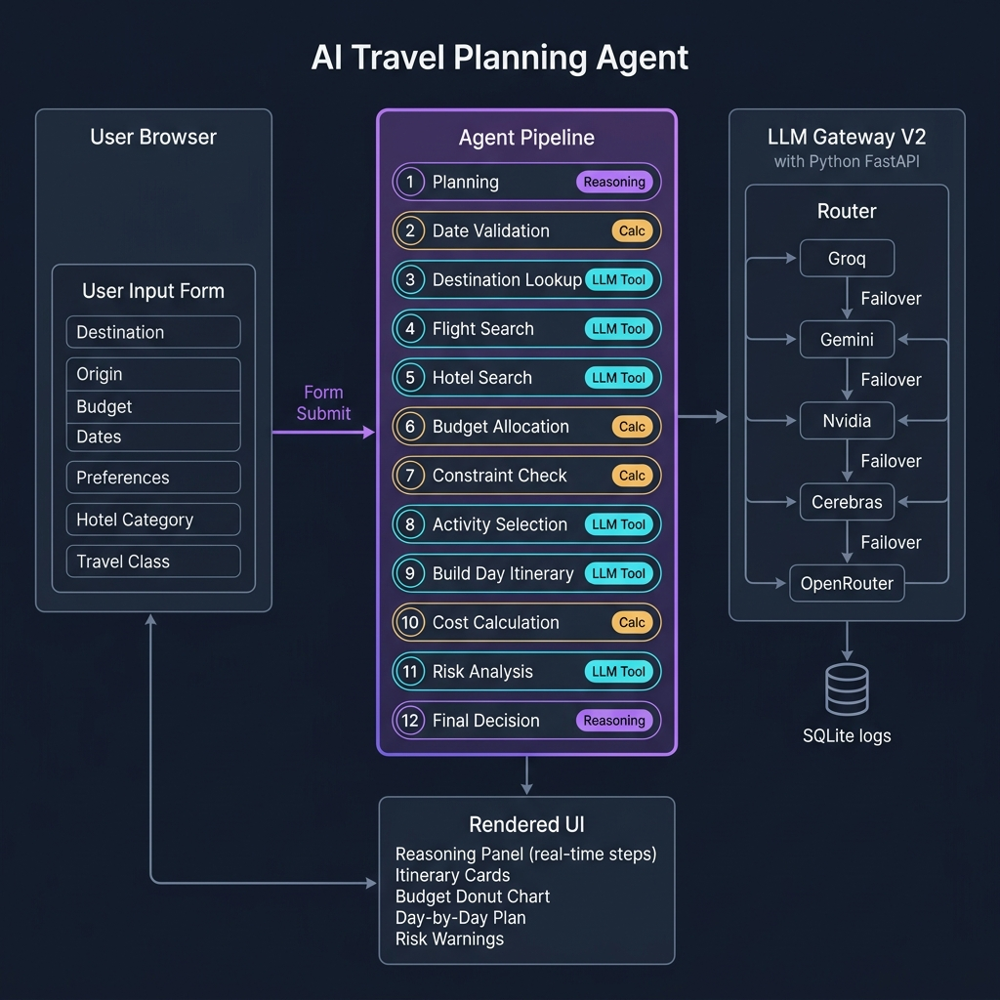
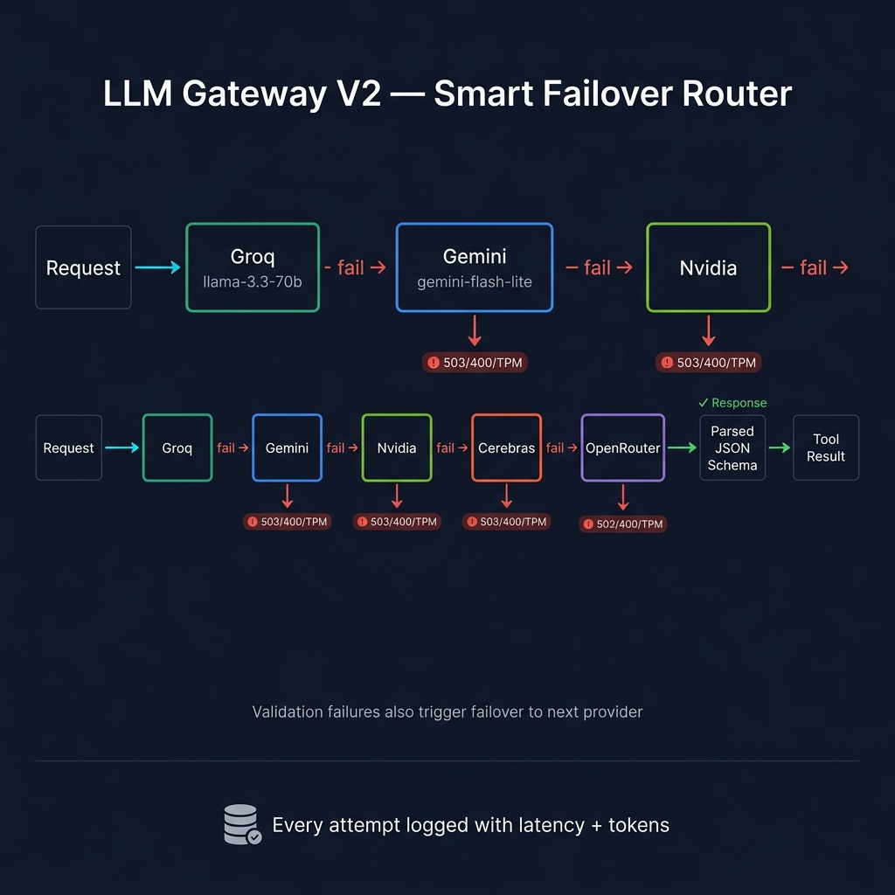

<div align="center">

# ✈️ AI Travel Planning Agent

**A fully agentic, LLM-powered travel planning application that creates complete, personalized trip itineraries through a real-time, multi-step reasoning pipeline.**



[](LICENSE)
[](https://python.org)
[](https://fastapi.tiangolo.com)
[](#)

</div>

---

## 🌟 What Is This?

The AI Travel Planning Agent is a **glass-morphism, dark-mode web application** that takes your destination, budget, and preferences — and runs a fully transparent, multi-step AI reasoning pipeline to produce a complete day-by-day itinerary.

Unlike simple chatbots, every reasoning step is **shown live in the UI**, with tool call inputs/outputs, budget verifications, and risk assessments all visible in real time, like watching an AI "think out loud."

---

## 🗂️ Project Structure

```
L5/
├── index.html              # Main single-page application shell
├── style.css               # Full UI design system (dark mode, glassmorphism)
├── app.js                  # Agent pipeline engine + UI rendering controller
├── tools.js                # LLM-powered tool library (11 agent tools)
├── data.js                 # Reference data (fallback/static values)
├── .env.example            # API key configuration template
├── .gitignore
│
├── docs/
│   └── images/             # Architecture and flow diagrams
│
└── llm_gatewayV2/          # Python FastAPI backend — LLM router
    ├── main.py             # FastAPI app, routes, structured output validation
    ├── router.py           # Smart provider failover router
    ├── providers.py        # All LLM provider integrations
    ├── schemas.py          # Pydantic request/response models
    ├── cache.py            # Gemini implicit caching layer
    ├── db.py               # SQLite call logging (latency, tokens, errors)
    ├── client.py           # Typed Python client for the gateway
    ├── requirements.txt    # Python dependencies
    └── static/             # Gateway monitoring web dashboard
```

---

## 🚀 How It Works — Step by Step

When the user clicks **"Plan My Trip"**, the application runs a 12-step sequential agent pipeline. Every step is rendered live in the **Reasoning Panel** on the right.

### Step 1 — Planning 🗺️
The agent decomposes the user's goal into a structured task list. No LLM call yet — this is pure orchestration logic in `app.js`.

### Step 2 — Date Validation 📅
Validates the travel date range, calculates the number of nights, and detects peak season. A built-in verification cross-checks the math.

### Step 3 — Destination Lookup 🔍
Calls the `getDestinationInfo` LLM tool, which asks the LLM gateway to return structured JSON about the destination: currency, language, cuisine, neighborhoods, safety rating, electrical plug type, etc.

### Step 4 — Flight Search ✈️
Calls the `flightSearch` LLM tool with the origin city, destination, travel class, and month. The LLM returns a realistic round-trip price estimate, airline options, and flight duration.

### Step 5 — Hotel Search 🏨
Calls the `hotelSearch` LLM tool with the destination and desired hotel category (budget/midrange/luxury). Returns a specific hotel name, nightly rate, total cost for the stay, and amenities.

### Step 6 — Budget Allocation 💰
Calls `calculateBudgetAllocation` to intelligently split the remaining budget (after fixed flight + hotel costs) across food, activities, local transport, and miscellaneous expenses, weighted by the user's preferences.

### Step 7 — Constraint Check ⚖️
Pure math in `app.js`. Calculates whether fixed costs leave a viable remaining balance. Fires warnings if the budget is too tight after flights and hotel.

### Step 8 — Activity Selection ⚡
Calls `selectActivities` with the destination, user preferences (culture, adventure, food, wellness, etc.), number of days, and activity budget. Returns a ranked list of specific activities with costs and durations.

### Step 9 — Build Day-by-Day Itinerary 🗓️
The heaviest LLM call. Calls `buildDayItinerary` and passes the hotel, all selected activities, and trip dates. The LLM maps each activity to a specific day with theme, neighborhood, breakfast/lunch/dinner suggestions, and local transport notes.

### Step 10 — Cost Calculation & Verification 🧮
Aggregates all cost items into a final total, calls `calculateTotalCost`, then performs an **independent verification** — re-summing all items separately and comparing to the tool output to catch any discrepancies.

### Step 11 — Risk Analysis ⚠️
Calls `analyzeRisks` to surface travel warnings, health advisories, high-risk categories, and an emergency fund recommendation for the specific destination and travel period.

### Step 12 — Final Decision 🏁
Computes the final **confidence score** (starts at 95%, deducted for each failure, missing data, or over-budget scenario), declares the plan within or over budget, and triggers the full itinerary render.

---

## 🧠 Architecture Overview

```
┌─────────────────────────────────────────────────────────────────┐
│                        USER BROWSER                             │
│                                                                 │
│  ┌──────────────────┐          ┌──────────────────────────┐    │
│  │  Input Form      │  Submit  │   Reasoning Panel        │    │
│  │  - Destination   │ ───────► │   Real-time step cards   │    │
│  │  - Origin        │          │   Tool call I/O          │    │
│  │  - Budget        │          │   Verification results   │    │
│  │  - Dates         │          └──────────────────────────┘    │
│  │  - Preferences   │                      │                    │
│  │  - Hotel / Class │          ┌──────────────────────────┐    │
│  └──────────────────┘          │   Itinerary Display      │    │
│                                │   Summary Cards          │    │
│                                │   Budget Donut Chart     │    │
│          app.js (Agent)        │   Day Cards + Activities │    │
│          tools.js (Tools) ────►│   Risk Warnings          │    │
│                                └──────────────────────────┘    │
└──────────────────────────────────┬──────────────────────────────┘
                                   │ HTTP POST /v1/chat
                                   ▼
┌─────────────────────────────────────────────────────────────────┐
│                   LLM Gateway V2 (FastAPI)                      │
│                                                                 │
│  Every tool call → structured JSON schema validation            │
│                                                                 │
│  Smart Failover Router:                                         │
│  Groq ──fail──► Gemini ──fail──► Nvidia ──fail──► Cerebras...  │
│                                                                 │
│  SQLite logging: provider, latency_ms, tokens, errors           │
└─────────────────────────────────────────────────────────────────┘
```

### LLM Gateway Failover



Each tool call from the browser hits the **LLM Gateway V2** — a FastAPI server that:

1. Routes to the first healthy provider in `LLM_ORDER`
2. Sends the structured JSON schema for the output it expects
3. Validates the response against the schema
4. If the provider is rate-limited, unavailable, or returns invalid JSON → **automatically retries with the next provider**
5. Logs every attempt to SQLite (provider, model, latency, tokens, error)

This means the app is resilient: if Groq is rate-limited mid-trip, Gemini takes over seamlessly — no user-visible failure.

---

## ⚙️ Setup & Installation

### Prerequisites

- Python 3.10+
- Node.js 18+ (for the `serve` static file server)
- At least **one API key** from the supported providers

### 1. Clone the repository

```bash
git clone https://github.com/your-username/ai-travel-agent.git
cd ai-travel-agent
```

### 2. Configure API Keys

Copy the example environment file and fill in your keys:

```bash
cp .env.example .env
```

Edit `.env` and add at minimum one provider key. **Groq is recommended** for fastest response times (free tier available at [console.groq.com](https://console.groq.com)):

```env
GROQ_API_KEY=gsk_...
GEMINI_API_KEY=AIza...
LLM_ORDER=groq,gemini,nvidia,cerebras,openrouter,github,ollama
GATEWAY_V2_PORT=8099
```

### 3. Start the LLM Gateway Backend

```bash
cd llm_gatewayV2
pip install -r requirements.txt
python main.py
```

The gateway will start on `http://localhost:8099`.
You can view the monitoring dashboard at `http://localhost:8099`.

### 4. Start the Frontend

In a new terminal, from the root `L5/` directory:

```bash
npx -y serve . --listen 3000
```

Open your browser at **[http://localhost:3000](http://localhost:3000)**.

---

## 🛠️ Agent Tools Reference

All tools live in [`tools.js`](tools.js) and communicate with the Gateway via structured JSON schema enforcement.

| Tool | Description | Type |
|------|-------------|------|
| `flightSearch` | Estimates round-trip flight price for a route and travel class | LLM |
| `hotelSearch` | Finds a specific hotel with nightly rate and amenities | LLM |
| `calculateBudgetAllocation` | Splits total budget across categories weighted by preferences | LLM |
| `calculateTotalCost` | Aggregates all cost items and cross-verifies the total | LLM |
| `validateDateRange` | Validates dates, counts nights, detects peak season | Logic |
| `getDestinationInfo` | Returns factual destination data (currency, language, cuisine…) | LLM |
| `selectActivities` | Picks and ranks activities matching preferences within budget | LLM |
| `buildDayItinerary` | Constructs the full day-by-day plan with meals and transport | LLM |
| `analyzeRisks` | Surfaces travel risks, warnings, and emergency fund advice | LLM |

---

## 🔧 Configuration

### Changing LLM Provider Priority

Edit `LLM_ORDER` in your `.env` file:

```env
# Fastest (Groq) first, most capable (GPT-4.1) last for fallback
LLM_ORDER=groq,gemini,nvidia,cerebras,openrouter,github,ollama
```

### Changing the Gateway Port

```env
GATEWAY_V2_PORT=8099
```

Also update the port in `tools.js` line 25 if you change this:
```js
const response = await fetch('http://localhost:8099/v1/chat', {
```

### Using a Local Ollama Model

```env
OLLAMA_URL=http://localhost:11434
OLLAMA_MODEL=llama3.2  # or any model you have pulled
```

Then add `ollama` to your `LLM_ORDER`.

---

## 📊 Monitoring

The LLM Gateway has a built-in web dashboard at `http://localhost:8099` showing:
- Live call history with provider, model, latency, and token usage
- Provider health status
- Failover events

---

## 🏗️ Tech Stack

| Layer | Technology |
|-------|-----------|
| Frontend | HTML5, Vanilla CSS (glassmorphism), Vanilla JS |
| Fonts | Google Fonts — Outfit |
| Backend | Python 3.10+, FastAPI, Uvicorn |
| LLM Routing | Custom failover router with SQLite logging |
| Providers | Groq, Google Gemini, Nvidia NIM, Cerebras, OpenRouter, GitHub Models, Ollama |
| Data Validation | JSON Schema (structured outputs), Pydantic |

---

## 📄 License

MIT © 2026
